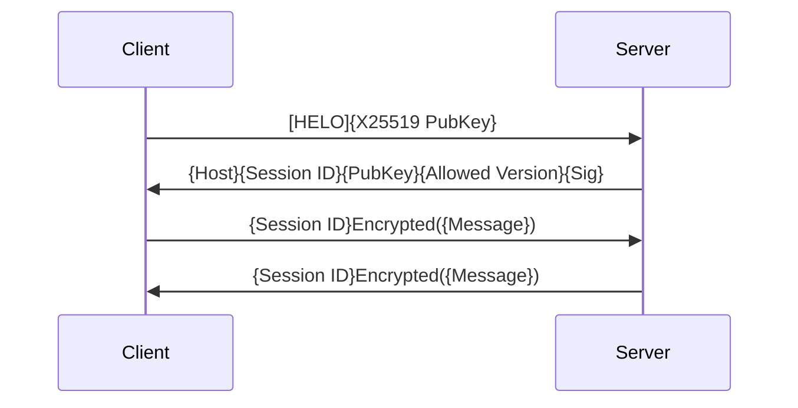

# Phi Basic Protocol Document

## Introduction

## Connections

### Layer 1 (OSI L5)

This layer is based on `UDP`.

The client initiates the protocol by sending a `HELO` message, which **MUST** containing an ephemeral `X25519` public key for use in `ECDH` key agreement.

The server reponds with a Host message containing a globally shared monotonically increasing `Session ID`, the server's `X25519` puiblic key, and the list of supported protocol version.
The server couputes a shared secret via `X25519` key agreement using its private key and the client's public key. A symmetric encryption key is derived from this shared secret and is used with `Ed25519` to signatured the message.

Following successful completion of the handshake, all subsequent packets **SHALL** consist of a `Session ID` field.
The payload **MUST** be encrypted with `AES256-GCM` and using the session keys established during the handshake procedure.

### 
